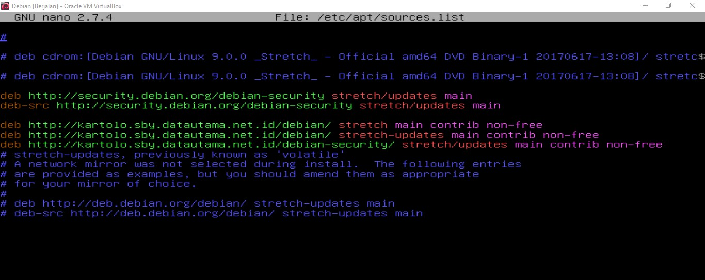
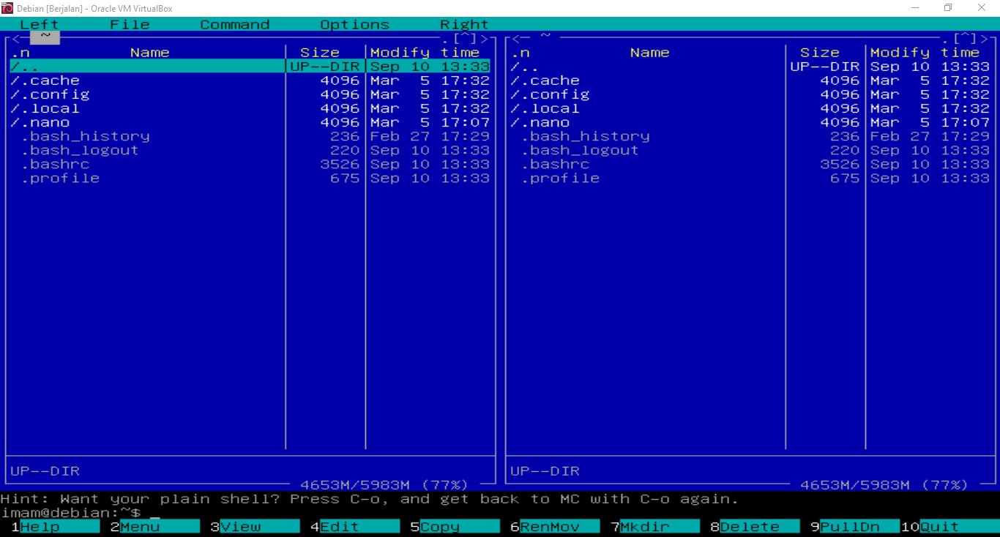
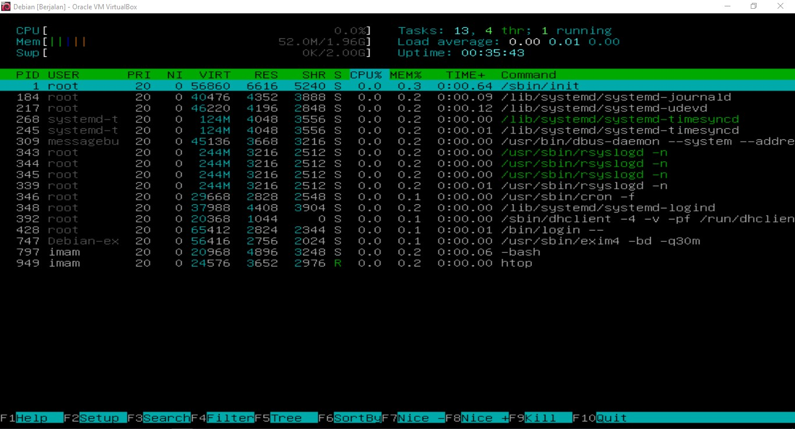

# PACKAGE MANAGEMENT IN LINUX DEBIAN 
## OVERVIEW
[Evolusi OS](#evolusi-os-ubuntu--debian)

[Perintah su . su - , sudo](#perintah-su--su----sudo)

[Package Maintenance](#package-maintenance)

* Setting repository
* Arti versi repository
* Contoh instalasi repository
  * MC
  * Net-tools
  * Htop

### Evolusi OS (Ubuntu & Debian)

Seperti halnya manusia, system operasi (OS) yang kita miliki dan kita gunakan saat ini tentunya tidak langsung muncul dalam bentuk yang sudah sebagus sekarang. Ya, system operasi (OS) juga pernah mengalami masa-masa sebuah evolusi ( tingkat pengembangannya).Mulai dari jaman tanpa OS, awal terciptanya OS, hingga evolusi-evolusi yang perlu dilakukan pengembangan dengan tujuan menambal kekurangan kekurangan yang ada dimiliki ole OS pendahuluannya. Akan ada 4 masa evolusi OS yang akan saya bahas Kali ini yaitu :

1. <strong>Generasi Pertama (1945-1955) atau Serial Processing</strong>
   
Generasi pertama merupakan awal perkembangan sistem komputasi elektronik sebagaipengganti sistem komputasi mekanik, hal itu disebabkan kecepatan manusia untuk menghitungterbatas dan manusia sangat mudah untuk membuat kecerobohan, kekeliruan bahkan kesalahan.Pada generasi ini belum ada sistem operasi, maka sistem komputer diberi instruksi yang harusdikerjakan secara langsung

2. <strong>Generasi Kedua (1955-1965) atau Simple Batch System</strong>
   
Generasi kedua memperkenalkan Batch Processing System, yaitu Job yang dikerjakandalam satu rangkaian, lalu dieksekusi secara berurutan.Pada generasi ini sistem komputer belumdilengkapi sistem operasi,   tetapi  beberapa  fungsi sistem operasi telah ada, contohnya   fungsisistem operasi   ialah  FMS  (Fortran   Monitoring  System)   dan IBSYS.  Jadi   generasi  komputerkedua ini merupakan generasi pertama dari sistem Operasi.

3. <strong>Generasi Ketiga (1965-1980) atau Multiprogramming Batch System</strong>
   
Multi-programming adalah   salah   satu   teknik   penjadwalan   dimana   tugas   (task)   yangsedang berjalan tetap berjalan sampai ia melakukan operasi yang membutuhkan waktu untukmenunggu respon dari luar (external event), misalnya membaca data dari disket/CD/dsb, atausampai komputer memaksa untuk menukar tugas yang sedang berjalan dengan tugas lainnya.

4. <strong>Generasi Keempat (Pasca 1980an) atau Time-Sharing System </strong>
   

   Time-Sharing   System adalah metode   yang   dipakai   dalam   sistem   operasi   yangmemungkinkan   sejumlah   pemakai   dapat   berinteraksi   dengan   proses   yang   dibuatnya   secarabergantian   dengan   jumlah   waktu   yang   sama.  Time   sharing   merupakan   pengembangan   lebihlanjut dari multiprogramming.Time-Sharing   memungkinkan  beberapa  pemakai   komputer  menggunakan   CPU   secarabersamaan   dan   CPU   akan   memberikan   waktunya   bergantian   kepada   setiap   pemakai   untukmemproses programnya dalam waktu yang sangat cepat
   

* <strong>Ubuntu</strong>
  
Ubuntu pertama kali dirilis pada tanggal 20 Oktober 2004 oleh Canonical Ltd., sebuah perusahaan yang didirikan oleh entrepreneur Mark Shuttleworth. Ubuntu awalnya didasarkan pada distribusi Debian Linux, tetapi seiring waktu telah mengembangkan identitasnya sendiri dan memperkenalkan fitur-fitur baru.

* <strong>Debian</strong>
  

  Debian adalah sistem operasi open-source yang populer berbasis pada kernel Linux. Pertama kali dirilis pada tahun 1993, Debian telah menjadi salah satu distribusi Linux yang paling stabil dan aman. Debian dirancang untuk memenuhi kebutuhan berbagai pengguna, dari pengguna rumahan hingga perusahaan besar.
  

### Perintah su , su - , sudo
* SU
  
SU merupakan singkatan dari <strong>Switch User</strong> bukan <strong>Super User</strong>, jadi dengan perintah ini kita dapat merubah user kita dari user1 ke user2 di dalam sebuah system. Tetapi jika kalian mengetikkan "su" tanpa nama user yang lain di belakangnya maka secara default system akan <strong >masuk ke dalam root user (Super User) namun ke folder home</strong>

* SU - 
  
Sama dengan perintah "su" namun ketika anda mengetikkan "su -" maka secara default system akan <strong >masuk ke dalam root user (Super User) di folder root langsung </strong>

* SUDO
  
Sudo merupakan singkatan dari <strong>Super User Do</strong>, fungsi dari perintah ini adalah kita meminta ijin agar kita diijinkan untuk menjalankan perintah superuser dengan menggunakan user biasa sebagaimana ditentukan oleh kebijakan keamanan. dengan kata lain kita <strong>bisa menggunakan perintah dari Super user namun tidak semuanya.</strong>

### Package Maintenance
<ul>
    <li>Setting Repository</li>
    Untuk menyetting repositoory , ikuti langkah berikut ini :
    <ol style="1">
        <li>
            Masuk ke dalam terminal linux Anda. disini saya menggunakan Debian 9.
        </li>
        <li>
            Masuk ke dalam file repository dengan mengetikkan <code>nano /etc/apt/sources.list</code> maka akan muncul tampilan seperti di bawah ini.
            
            Tampilan diatas merupakan repository dari sistem operasi linux kita. script :
            <code>deb http://kartolo.sby.datautama.net.id/ stretch main contrib non free</code> merupakan contoh repository yang kita ambil untuk semua package linux kita. Jika Anda belum mempunyai repository dapat mencarinya di <a href="https://www.linuxsec.org/p/daftar-repository-lokal-indonesia.html">Link Daftar Repository Linux</a>. <strong>Sesuaikan Dengan Versi Linux Masing-masing.</strong>
        </li>
        <li>
        Setelah menambahkan repository kita save file tersebut dengan tekan tombol <code>Ctrl+O</code> kemudian ENTER, dan keluar menggunakan perintah <code>Ctrl+X</code>.
        </li>
        <li>
        Terakhir, kita terapkan repository yang sudah kita tambahkan sebelumnya dengan update package-nya. dengan cara jalankan perintah <code>apt update</code>.
        </li>
    </ol>
    <li>Arti versi repository</li>
    
Arti dari versi di repository adalah nomor yang menunjukkan versi paket perangkat lunak yang tersedia di suatu repository pada sistem operasi Linux. Versi ini digunakan untuk membedakan antara versi lama dan versi baru dari paket perangkat lunak, dan untuk memastikan bahwa pengguna memiliki versi yang paling baru dan stabil dari perangkat lunak yang diinstal pada sistem mereka. Nomor versi biasanya terdiri dari tiga angka yang dipisahkan oleh titik, misalnya 1.2.3, di mana angka pertama menunjukkan nomor utama versi, angka kedua menunjukkan nomor rilis, dan angka ketiga menunjukkan nomor revisi atau perbaikan kecil. Semakin tinggi nomor versi, semakin baru perangkat lunak tersebut.

    
Pada repository Linux, terdapat empat komponen utama yaitu:

    <ul>
    <li>
        <strong>Main</strong>: Komponen utama yang menyediakan paket perangkat lunak bebas dan terbuka sepenuhnya yang didukung secara resmi oleh distribusi Linux.
    </li>
    <li>
        <strong>Universe</strong>: Komponen yang menyediakan paket perangkat lunak bebas dan terbuka sepenuhnya, tetapi tidak didukung secara resmi oleh distribusi Linux.
    </li>
    <li>
        <strong>Restricted</strong>: Komponen yang menyediakan paket perangkat lunak yang tidak sepenuhnya bebas karena lisensi yang dibatasi, seperti driver perangkat keras tertentu.
    </li>
    <li>
        <strong>Multiverse</strong>: Komponen yang menyediakan paket perangkat lunak yang tidak sepenuhnya bebas dan terbuka karena alasan non-lisensi, seperti plug-in media yang tidak didukung secara resmi.
    </li>
    <li>
        <strong>Paket perangkat lunak</strong>: pada komponen Multiverse dapat digunakan dengan lisensi tertentu atau memiliki batasan penggunaan tertentu. Beberapa paket perangkat lunak pada komponen Multiverse misalnya seperti plug-in untuk media player dan codec untuk memutar file multimedia tertentu.
    </li>
    </ul>
    <li>Contoh instalasi repository
        <ul>
            <li>MC
                
(Midnight Commander) atau disingkat MC adalah aplikasi manajer berkas yang berjalan di lingkungan teks pada sistem operasi Linux. MC menyediakan antarmuka pengguna teks yang mudah digunakan untuk menjelajahi berkas dan direktori pada sistem operasi. MC memiliki fitur-fitur seperti pengelolaan berkas dan direktori, pengeditan teks, pengarsipan dan ekstraksi berkas, dan masih banyak lagi. MC sangat cocok bagi pengguna yang terbiasa dengan antarmuka pengguna teks dan ingin melakukan tugas-tugas administratif pada sistem operasi Linux.

                
Berikut ini langkah-langkah untuk menginstal MC di Debian : 

                <ol style="1">
                    <li>Jalankan perintah <code>apt install mc</code> (as root)</li>
                    <li>Tunggu installasi hingga selesai.</li>
                    <li>Jika sudah, coba jalankan MC dengan menjalankan perintah <code>mc</code> (as root). Maka akan tampil seperti di bawah ini.   </li>
                </ol>
            </li>
            <li>Net-tools
                
Net-Tools adalah seperangkat utilitas jaringan pada sistem operasi Linux yang digunakan untuk memeriksa dan mengkonfigurasi koneksi jaringan pada sistem. Beberapa utilitas yang termasuk dalam paket net-tools adalah ifconfig (untuk mengkonfigurasi antarmuka jaringan), route (untuk mengkonfigurasi routing jaringan), dan netstat (untuk memeriksa koneksi jaringan). Namun, pada distribusi Linux yang lebih baru, net-tools telah digantikan oleh utilitas jaringan yang lebih modern seperti iproute2.

                
Berikut ini langkah-langkah untuk menginstal net-tools di Debian : 

                <ol style="1">
                    <li>Jalankan perintah <code>apt install net-tools</code> (as root)</li>
                    <li>Tunggu installasi hingga selesai.</li>
                    <li>Setelah instalasi selesai, Anda dapat menggunakan utilitas net-tools seperti <code>ifconfig</code>, <code>route</code>, dan <code>netstat</code> untuk memeriksa dan mengkonfigurasi koneksi jaringan pada sistem Anda.
                </ol>
            </li>
            <li>Htop
            
Htop adalah alat pemantauan proses untuk Linux yang memungkinkan pengguna untuk melihat dan mengelola proses yang sedang berjalan di sistem mereka. Ini memberikan tampilan waktu nyata dari penggunaan CPU, penggunaan memori, dan statistik sistem lainnya dalam format yang mudah dibaca. HTOP memungkinkan pengguna untuk mengurutkan proses berdasarkan berbagai parameter, seperti penggunaan CPU atau penggunaan memori, dan menyediakan opsi untuk menjeda atau menghentikan proses sesuai kebutuhan. Ini adalah alat yang berguna untuk administrator sistem dan pengguna tingkat lanjut yang perlu memantau dan mengelola kinerja sistem Linux mereka.

            
Berikut ini langkah-langkah untuk menginstal MC di Debian : 

                <ol style="1">
                    <li>Jalankan perintah <code>apt install htop</code> (as root)</li>
                    <li>Tunggu installasi hingga selesai.</li>
                    <li>Jika sudah, coba jalankan htop dengan menjalankan perintah <code>htop</code> (as root). Jika berhasil maka akan tampil seperti di bawah ini.   </li>
                </ol>
            </li>
        </ul>
    </li>
</ul>